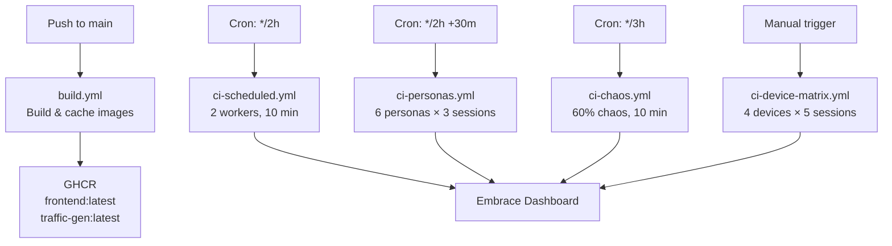

# CI Workflows — Embrace Web RUM Demo

This document describes the GitHub Actions workflows that continuously generate Embrace Web RUM telemetry from this project.

## How Workflows Relate



## Workflow Summary

| Workflow | File | Trigger | RUN_SOURCE | Workers | Duration | Sessions/run |
|---|---|---|---|---|---|---|
| **Build** | `build.yml` | Push to `main`, manual | — | — | ~5 min | — |
| **Scheduled** | `ci-scheduled.yml` | Every 2h, manual | `scheduled-light` | 2 | ~10 min | ~20–30 |
| **Personas** | `ci-personas.yml` | Every 2h (+30m offset), manual | `persona-{name}` | 1 per persona | ~5 min each | 3 per persona |
| **Chaos** | `ci-chaos.yml` | Every 3h, manual | `chaos` | 2 | ~10 min | ~20–30 |
| **Device Matrix** | `ci-device-matrix.yml` | Manual only | `matrix-{device}` | 1 per device | ~5 min each | 5 per device |

### Daily Volume Estimate (automated only)

| Workflow | Runs/day | Sessions/run | Total/day |
|---|---|---|---|
| Scheduled | 12 | ~25 | ~300 |
| Personas | 12 × 6 personas | 3 | ~216 |
| Chaos | 8 | ~25 | ~200 |
| **Total** | | | **~716 sessions/day** |

### GitHub Actions Minutes (public repo = unlimited free)

| Workflow | Runs/day | Minutes/run | Total/day |
|---|---|---|---|
| Scheduled | 12 | ~15 | ~180 |
| Personas | 12 | ~50 (6 jobs × ~8 min, max 2 parallel) | ~600 |
| Chaos | 8 | ~15 | ~120 |
| **Total** | | | **~900 min/day** |

> **Note:** Public repos get unlimited GitHub Actions minutes. If this repo were private, the 2,000 min/month free tier would be exhausted in ~2 days.

## Required Repo Configuration

### Variables (Settings → Secrets and variables → Actions → Variables)

| Name | Value | Purpose |
|---|---|---|
| `EMBRACE_APP_ID` | Your Embrace Web app ID | Baked into the frontend JS bundle at build time |

### Secrets

| Name | Value | Purpose |
|---|---|---|
| `GITHUB_TOKEN` | Auto-provided | GHCR authentication (no setup needed) |

No additional secrets are required unless you enable source map uploads, in which case add `EMBRACE_API_TOKEN` as a repository secret.

## Filtering Sessions in the Embrace Dashboard

Each workflow tags its sessions with a `run_source` session property. Use the Embrace dashboard filters:

- `run_source = scheduled-light` — Scheduled traffic
- `run_source = persona-buyer` — Persona-specific sessions
- `run_source = chaos` — High-chaos sessions
- `run_source = matrix-iphone-14` — Device-specific sessions
- `run_source = local` — Local development
- `run_source = organic` — Real users (no tag set)

## How to Add a New Workflow

1. Create a new file under `.github/workflows/`
2. Use this template structure:
   ```yaml
   name: My New Workflow
   on:
     schedule:
       - cron: '0 */4 * * *'
     workflow_dispatch:
   concurrency:
     group: my-workflow
     cancel-in-progress: true
   jobs:
     run:
       runs-on: ubuntu-latest
       timeout-minutes: 25
       steps:
         - uses: actions/checkout@v4
         - name: Create .env
           run: |
             cat > .env <<EOF
             EMBRACE_APP_ID=${{ vars.EMBRACE_APP_ID }}
             TRAFFIC_WORKER_COUNT=1
             TRAFFIC_MAX_DURATION_S=600
             RUN_SOURCE=my-custom-source
             EOF
         - name: Start stack
           run: docker compose up -d
         - name: Wait for health
           run: |
             for i in $(seq 1 60); do
               curl -fsS http://localhost:8080 > /dev/null 2>&1 && break
               sleep 1
             done
         - name: Run traffic
           run: docker compose --profile traffic up -d traffic-gen && sleep 620
         - name: Tear down
           if: always()
           run: docker compose --profile traffic down -v
   ```

3. Set the `RUN_SOURCE` env var to a unique value
4. Update this document with the new workflow details
5. Push to `main`

## Constraints

- **Runner RAM:** ~7 GB available on `ubuntu-latest`. Keep `TRAFFIC_WORKER_COUNT` ≤ 2
- **Job timeout:** 6 hours max, but aim for < 25 minutes
- **Concurrency:** Each workflow uses a `concurrency.group` to prevent overlapping runs
- **Playwright version:** Must match between `traffic-gen/Dockerfile` base image tag and `traffic-gen/package.json` — currently pinned to `1.49.0`
